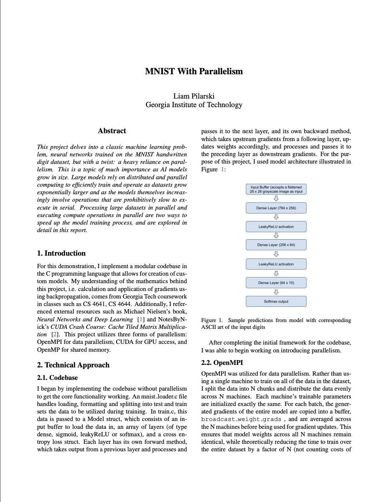

# Project Build and Run Instructions

## Building the Project

To build the project, run:

```bash
make clean && make
```

This will generate the `train` executable.

## Running with OpenMPI

To run the project using OpenMPI, use:

```bash
srun -n {number of processes} ./train
```

Replace `{number of processes}` with the desired number of processes.

## Configuration (`macros.h`)

Before building, ensure that the configurations in `macros.h` match your intended setup:

```c
#define USE_CUDA 1
#define USE_MPI_WEIGHT_SHARING 0
#define USE_MPI_MODEL_PARALLELISM 1
#define LR 0.01
```

### Configuration Options

- **USE_CUDA**  
  When set to `1`, CUDA will be utilized for GPU acceleration.  
  When set to `0`, OpenMP optimizations will be used instead.

- **USE_MPI_WEIGHT_SHARING**  
  When enabled (`1`), multiple processes will process the dataset in parallel and share gradients during training.  
  When disabled (`0`), all processes will train independently without gradient sharing.

- **USE_MPI_MODEL_PARALLELISM**  
  Switches between defining the model with `init_model` and `init_model_parallel`.  
  It is the user's responsibility to define the model correctly when using model parallelism, particularly by using the appropriate `MPISendBuffer` and `MPIRecvBuffer` layers.

- **LR**  
  Controls the learning rate during training.


# View Report
[](report.pdf)